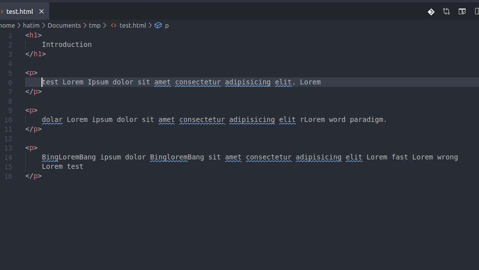

# select-until-pattern

This *Visual Studio Code* offers several actions to quickly enlarge your selection by selecting text from the current position of your cursor to the pattern and actions described on the user input.



## Notes

This is an improvement of the "[Select Until extension](https://marketplace.visualstudio.com/items?itemName=jakelucas.code-select-until?/text)" by adding some additional features like multi-lines selection, occurrence search etc ...

## Usage

To display the user input where you will add the desired word or pattern, you can choose the `Select until pattern` command from the command palette or add a key binding to your keyboard shortcuts file, for example:

```
{ "key": "ctrl+e", "command": "extension.select-until-pattern" }
```

### Flags

Here are some flags to use to indicate the type of search you want to perform, these flags must be added at the end of your word search after a slash :

- `i` : makes the search case-insensitive
- `r` : reverses the search to expand the selection to the left
- `c` : tells the extension to include the search match from the selection
- `e` : tells the extension to exclude the search match from the selection (default behavior)
- `d` : tells the extension to delete selections 
- `number` : select the n occurrence of the searched word

## Extension Settings

This extension contributes the following settings:

* `select-until-pattern.includePatternInSelection`: include or not the searched pattern in the selection
* `select-until-pattern.saveLastPattern`: Save the last pattern searched in the user input

## Release Notes

Users appreciate release notes as you update your extension.

### 1.0.0

Initial release of the extension

*Logo made by [ultimatearm](https://www.flaticon.com/authors/ultimatearm)*

**Enjoy!**
